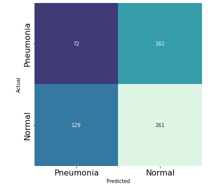
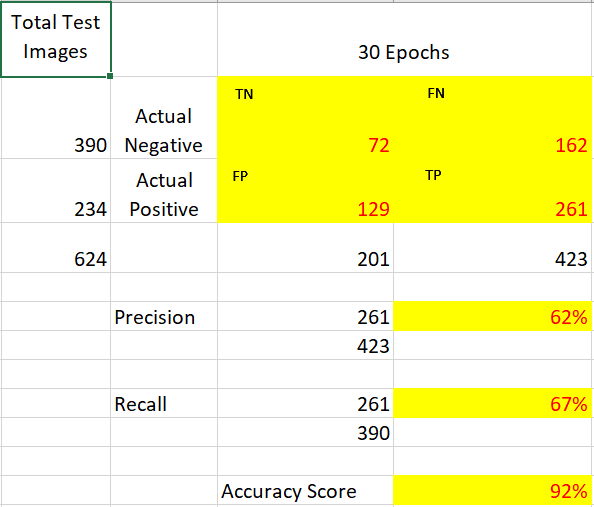
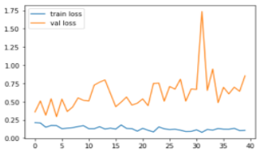
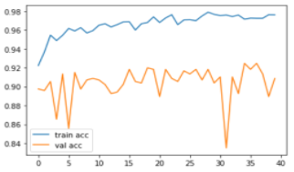
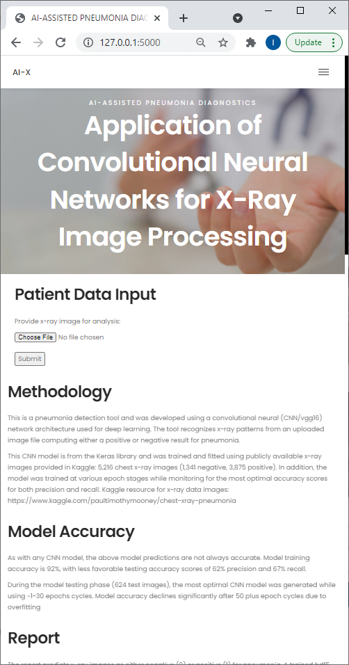

# Convolutional Neural Networks: Machine Learning and Pneumonia

In this project we have developed, trained and evaluated a convolutional neural network model (VGG16) which can be used by physicians for pneumonia diagnostics based on X_ray image processing.

## Project motivation

According to the [American Thoracic Society](https://www.thoracic.org/patients/patient-resources/resources/top-pneumonia-facts.pdf) and the [American Lung Association](https://www.lung.org/lung-health-diseases/lung-disease-lookup/lung-cancer/resource-library/lung-cancer-fact-sheet) pneumonia is the world’s leading cause of death among children under 5 years of age. 

More than 150,000 people are estimated to die from lung cancer each year with infections, including pneumonia, being the second most common cause of death in people with lung cancer. 

These days, with the onset of COVID, the health system is stretched to its limit. Availability of the physicians and specifically pulmonologists is scarce, with many doctors working overtime for 2nd year running.  Which is why developing a tool, capable of speeding up X-ray image processing and eventual pneumonia diagnostics is so vital.

## Dataset

Data for this study was sourced from [Kaggle](https://www.kaggle.com/paultimothymooney/chest-xray-pneumonia).

The dataset is organized into 3 folders (train, test, val) and contains subfolders for each image category (Pneumonia/Normal). There are **5,863** X-Ray images (JPEG) and 2 categories (Pneumonia/Normal).

Chest X-ray images (anterior-posterior) were selected from retrospective cohorts of pediatric patients of one to five years old from Guangzhou Women and Children’s Medical Center, Guangzhou, China.  All chest X-ray imaging was performed as part of patients’ routine clinical care.

For the analysis of chest x-ray images, all chest radiographs were initially screened for quality control by removing all low quality or unreadable scans. The diagnoses for the images were then graded by two expert physicians before being cleared for training the AI system. In order to account for any grading errors, the evaluation set was also checked by a third expert. [Figure 1](#xray_examples) contains some of the sample X-ray images from the dataset.

<a name="xray_examples">Figure 1.</a> Examples of Chest X-Rays in Patients with Pneumonia

## Model Construction, Testing & Optimization

This CNN model is from the Keras library and was trained and fitted using publicly available x-ray images provided in Kaggle: 5,216 chest x-ray images (1,341 negative, 3,875 positive). In addition, the model was trained at various epoch stages while monitoring for the most optimal accuracy scores for both precision and recall. Final notebook (developed using Google Collab) can be found [here](https://github.com/lcswsher/Group_4_Project_4/blob/main/CNN_Group4_Project4__30_Epochs.ipynb), with the corresponding model saved into an [chest_xray_30_Epochs.h5](https://github.com/lcswsher/Group_4_Project_4/blob/main/input/chest_xray_30_Epochs.h5) file.

<table style="border: 3px solid white;">
    <tr style="vertical-align:top">
        <td style="background-color:lightgrey;border: 3px solid white"><strong>Tensorflow Keras</strong> 
			<ul>   
                <li>Model - VGG16 as a basis for CNN model</li>
                <li>Image size = 224, 224</li>
			</ul>
        </td>
        <td style="border: 3px solid white">&rarr;</td>
        <td style="background-color:lightgrey;border: 3px solid white"><strong>Compiling Model</strong> 
			<ul>   
                <li>Loss = categorical crossentropy</li>
                <li>Optimizer = adam</li>
			</ul>
        </td>
        <td style="border: 3px solid white">&rarr;</td>
        <td style="background-color:lightgrey;border: 3px solid white"><strong>Creating Generator</strong> 
			<ul>   
                <li>Keras ImageDataGenerator</li>
                <li>Scaled (1./255) <small>(to scale RGB pixel values from range [0,255] -> [0,1])</small></li>
			</ul></td>
        <td style="border: 3px solid white">&rarr; ... </td>
    </tr>
</table>

<table style="border: 3px solid white;">
    <tr style="vertical-align:top">
        <td style="border: 3px solid white">... &rarr;</td>
        <td style="background-color:lightgrey;border: 3px solid white"><strong>Building and Fitting Models</strong> 
			<ul>   
                <li>10, 20, 30, 40, 100 Epochs</li>
                <li>Precision and Recall scores</li>
                <li>Validation/Loss Accuracy</li>
                <li>Train/Loss Accuracy</li>
                <li>Confusion Matrix</li>
			</ul>
        </td>
        <td style="border: 3px solid white">&rarr;</td>
         <td style="background-color:#a3cce9;border: 3px solid white"><strong>Final Training Model (hdf5 file) 
</strong> 
			<ul>   
                <li>1-30 Epochs </li>
                <li>62% Precision</li>
                <li>67% Recall</li>
                <li>92% Accuracy</li>
			</ul>
        </td>
    </tr>
</table>

<a name="workflow">Figure 2.</a> Data Model Implementation

### Model Accuracy

As with any CNN model, the above model predictions are not always accurate. Confusion matrix containing corresponding TP, TN, FP & FN counts is shown in [Figure 3](#cm). Model training accuracy is 92%, with less favorable testing accuracy scores of 62% precision and 67% recall.

During the model testing phase (624 test images), the most optimal CNN model was generated while using ~1-30 epochs cycles. Model accuracy declines significantly after 50 plus epoch cycles due to overfitting

 

<a name="cm">Figure 3.</a> Confusion matrix & accuracy calculation

### Data Model Optimization:

* Training the model to be more accurate at predictions required several steps

* Training for more epochs with different iterations of 1, 10, 20, 100 etc.

  * With more epochs used, validation loss and training accuracy increased
  * Validation accuracy remained at around ~90%

* Risk of overfitting to training data remained and increased with the increase of epochs over 30 epochs

* Created a confusion matrix to determine true positive/negative and false positive/negative values

  

  
<a name="loss">Figure 4.</a> Change in time (epochs) of the training vs validation loss of the developed model

  

  

  
<a name="accuracy">Figure 5.</a> Change in time (epochs) of the training vs validation accuracy of the developed model

## Frontend & deployment

Frontend was implemented via Flask, to enable X-ray image upload by users.

To run the tool user needs to run `python main.py` from the project folder after cloning and then proceed to the local host listed within the git Bash stdo window.

            

## Contributors

The following people have contributed to the work presented in this repository:

[Clay Swisher](https://github.com/lcswsher)

[Iryna Marchiano](https://github.com/i-am-phoenix)

[Simon Castellanos](https://github.com/simoncastellanos9)

[Elijah Abuel](https://github.com/Eabuel15)

